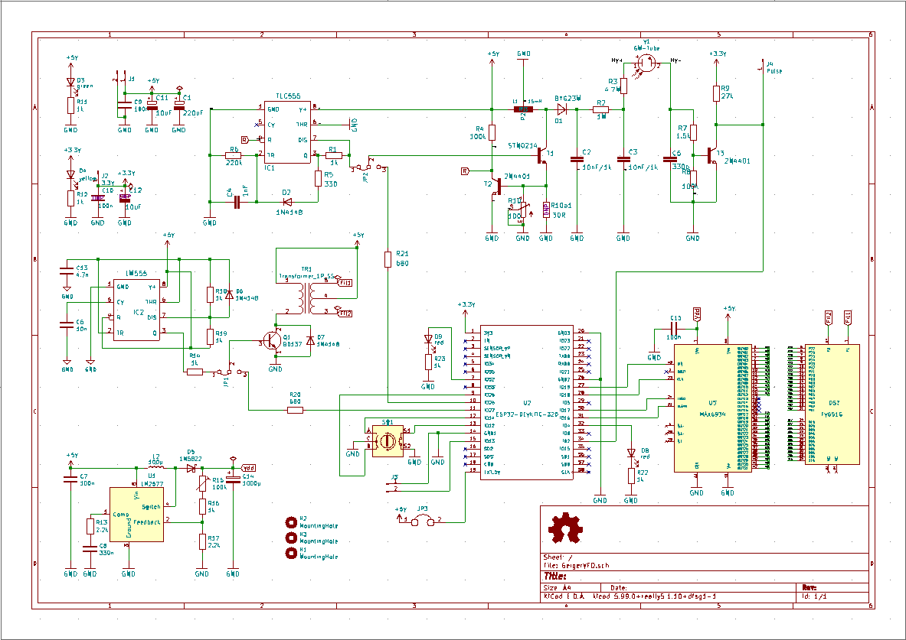
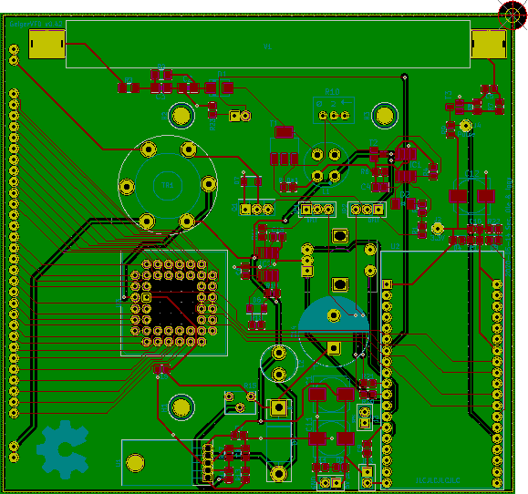
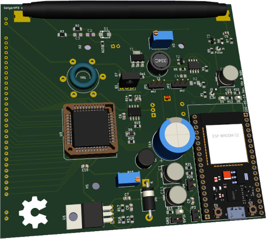
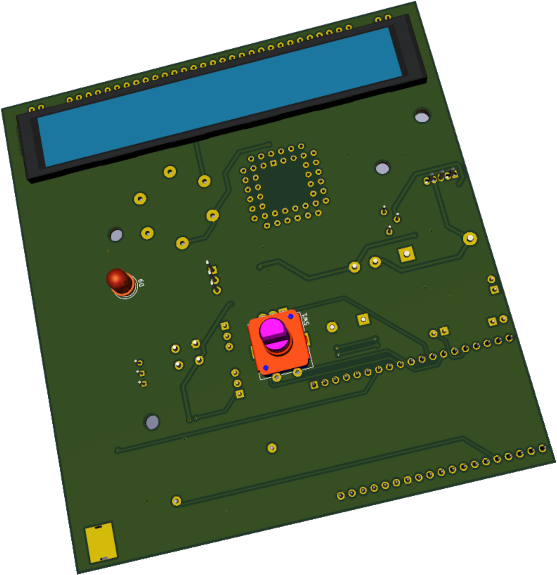
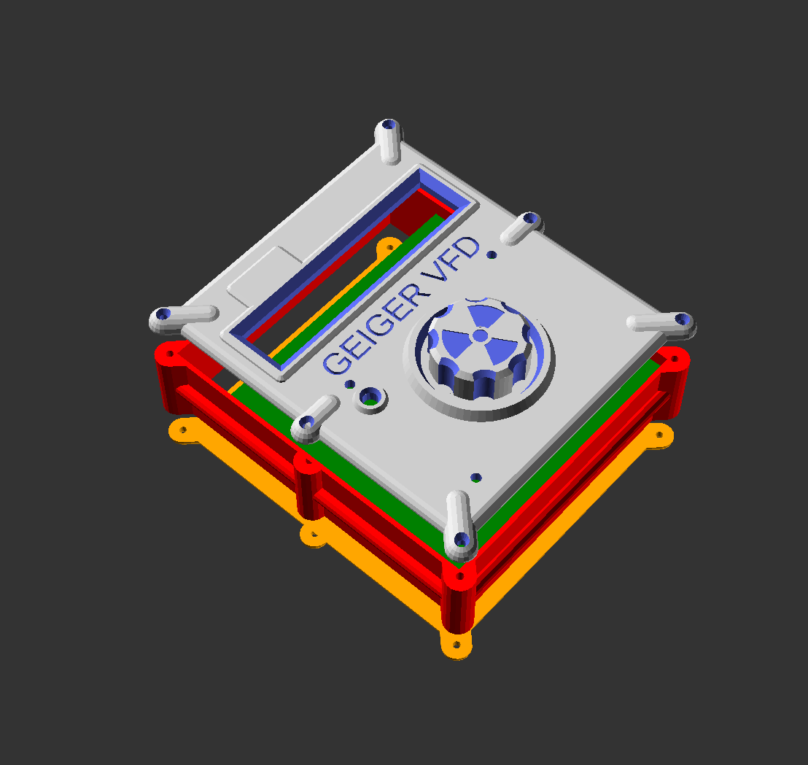

# Geiger counter with Vacuum fluorescent display
This repo is a collection of all the parts to build an [ESP32](https://www.espressif.com/en/products/socs/esp32) based handheld device to measure radioactivity with a [Geiger–Müller tube](https://en.wikipedia.org/wiki/Geiger%E2%80%93M%C3%BCller_tube) & display info on an [VFD](https://en.wikipedia.org/wiki/Vacuum_fluorescent_display).

Future plans are [Home Automation](https://esphome.io/) integration, logging radioactivity measurements over WiFi & displaying additional information like e.g. a Clock.

The device is be powered via Micro-USB port of the ESP32. Note that the current draw of the VFD may exceed the 500mA USB standard.

# PCB
The PCB is designed in [KiCad](https://www.kicad.org/). All source files are in the  [pcb](pcb) Subdirectory.

### Schematic:

### PCB:

### 3d render view:
 

# Case
The Case is designed in [OpenSCAD](https://openscad.org/). Sources reside in the [case](case/) Subdirectory.

# Firmware
:warning: Work in Progress :warning:

The firmware is written using [Espressif-IDF](https://docs.espressif.com/projects/esp-idf/en/latest/esp32/get-started/) and lives in the [firmware](firmware/) directory.
